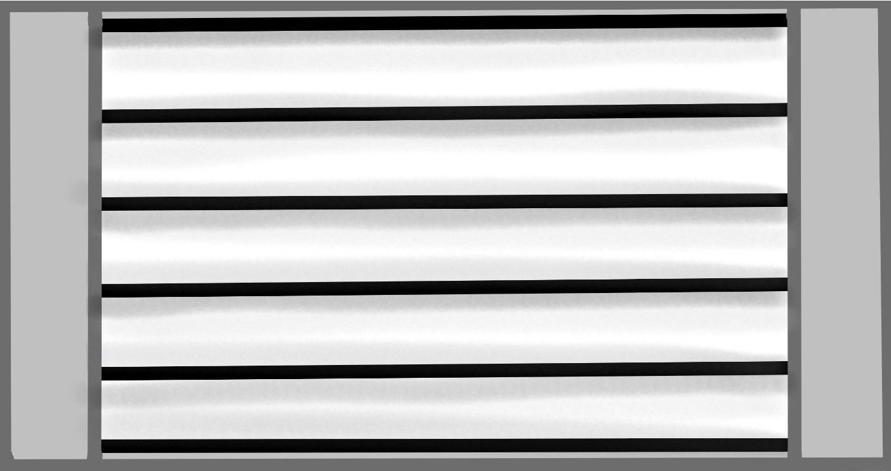

#  MatterDoor - Smart, Matter-capable do not disturb sign

A problem I encountered during the pandemic attending onlinre lectures was that my family did not know when I had the lectures. They would enter the room during lectures or tests. The problem is also present when working from home. People walking in when attending meetings was something people had to get used to. **But there is a solution!** If you have visited a radio station or saw one in a move, you must have seen the large ON AIR signs which light up signaling you to be cautios. I have made one for myself during the pandemic to signal when not to enter. This project is a better version of that prototype. It has cool animations on the five-row RGB display in the front of the device. The brain of MatterDoor is the nRF7002DK, Nordic Semiconductor's latest Matter-capable development kit. MatterDoor can be commissioned to  and controlled via a custom Matter fabric using the Android app in this repository, or any existing Matter-compatible ecosystem. Say goodbye to interrupted meeting and lectures.

## Matter

## Hardware

### BOM

### 3D-printed parts

**The STL files of the degined casing are available [here](./3dfiles)**

## Software

## Demo

