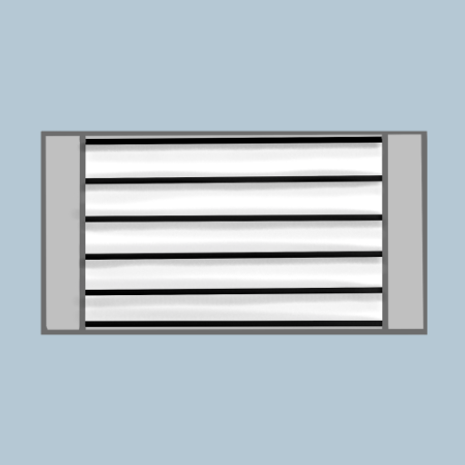

# MatterDoor android app

This code is a fork of [Google Home Mobile SDK Sample Applications for Matter](https://github.com/google-home/sample-apps-for-matter-android/tree/main). I made modifications so that the three states (`OFF`, `FREE`, `BUSY`) can be controlled from the application. Additionally, I created a new logo for the application along with changes to the underlying logic so that instead of using an on/off endpoint, a level endpoint is used for the state of the MatterDoor device. The actual code the of the app is contained within the "3p-ecosystem" folder. 

The MatterDoor device can be commissioned to this app's Matter fabric and can be shared as well.

  

